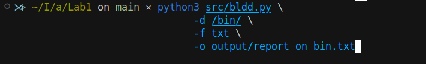
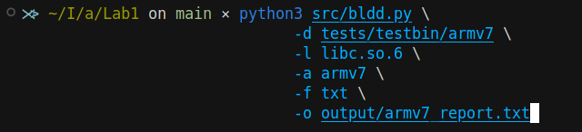

# Lab 1: Backward LDD (`bldd`)

## Abstract

This report documents the design, implementation, and testing of **bldd** (Backward LDD), a tool that scans directories for ELF executables and reports which ones depend on specified shared libraries. The tool supports four architectures (x86, x86\_64, armv7, aarch64) and outputs sorted usage reports in `txt` or `pdf` format.

## 1. Introduction

The standard `ldd` utility lists the shared libraries required by a given executable. **bldd** reverses this process: given one or more shared libraries, it finds *all* executables in a directory tree that depend on those libraries.

## 2. Objectives

* **Learn** how `ldd` and ELF dynamic linking work.
* **Implement** a configurable command‑line app to find executables using specified shared libraries.
* **Support** architectures: x86, x86\_64, armv7, aarch64.
* **Generate** a report sorted by usage count (high → low).
* **Provide** TXT and PDF output options, with a `--help` usage guide.

## 3. ELF & ldd Overview

1. **ELF Magic**: Executables start with `0x7F  'E'  'L'  'F'`.
2. **Dynamic Section** (`.dynamic`): Contains `DT_NEEDED` tags listing required shared libs.
3. **`ldd`**: Under the hood, parses `DT_NEEDED` and resolves library paths via the runtime loader.

## 4. Design and Implementation

### 4.1 Technology Stack

* **Language**: Python 3.10
* **Libraries**:

  * [`pyelftools`](https://github.com/eliben/pyelftools) for ELF parsing
  * [`reportlab`](https://www.reportlab.com/) (optional) for PDF generation

### 4.2 Architecture Support

Mapped ELF `e_machine` values to:

| Arch    | ELF Constant |
| :------ | :----------- |
| x86     | `EM_386`     |
| x86\_64 | `EM_X86_64`  |
| armv7   | `EM_ARM`     |
| aarch64 | `EM_AARCH64` |

### 4.3 Key Functions

* `is_elf_executable(path)`: Verifies ELF magic and `e_type` (ET\_EXEC or ET\_DYN).
* `get_file_arch(path)`: Reads `e_machine` from the ELF header.
* `get_needed_libs(path)`: Extracts `DT_NEEDED` entries from the `.dynamic` section.
* `scan_directory(root, libs, arch)`: Walks the tree, filters by arch, aggregates matching executables.
* `write_txt_report(...)` / `write_pdf_report(...)`: Outputs sorted reports.

### 4.4 Command‑Line Interface

```bash
usage: bldd.py [-h] -d DIR [-l [LIB ...]] [-a ARCH] [-o FILE] [-f FMT]

options:
  -h, --help            show this help message and exit
  -d DIR, --dir DIR     Root directory to scan for ELF executables
  -l [LIB ...], --libs [LIB ...]
                        Library names to search for, e.g., libssl.so.1.1. If not specified, all libraries will be reported.
  -a ARCH, --arch ARCH  Architecture filter (default: all)
  -o FILE, --output FILE
                        Path to save the report (default: bldd_report.txt)
  -f FMT, --format FMT  Report format (txt or pdf, default: txt)
```

## 5. Testing

### 5.1 Test Environment Setup

* Installed cross‑compilers:

  ```bash
  sudo apt install gcc-multilib build-essential \
       gcc-arm-linux-gnueabihf gcc-aarch64-linux-gnu
  ```
* Created `test.c` and compiled four dynamic binaries under `tests/testbin/`:

  ```bash
  gcc -o testbin/x86_64/test test.c
  gcc -m32 -o testbin/x86/test test.c
  arm-linux-gnueabihf-gcc -o testbin/armv7/test test.c
  aarch64-linux-gnu-gcc -o testbin/aarch64/test test.c
  ```

### 5.2 Sample Run & Output

**Command**:

```bash
$ python3 src/bldd.py \
    -d tests/testbin/ \
    -a all \
    -f txt \
    -o output/test_report.txt
```

**Resulting `test_report.txt`:**

```

Summary:
Total libraries found: 1
Total executables analyzed: 4

Detailed Report:
--------------

Library: libc.so.6
Total usages: 4
Executables:
  - tests/testbin/armv7/test (armv7)
  - tests/testbin/x86_64/test (x86_64)
  - tests/testbin/aarch64/test (aarch64)
  - tests/testbin/x86/test (x86)
```

Other commands where executed to test the implementation, you can find the results in the `output` folder.

**Other tests:**



