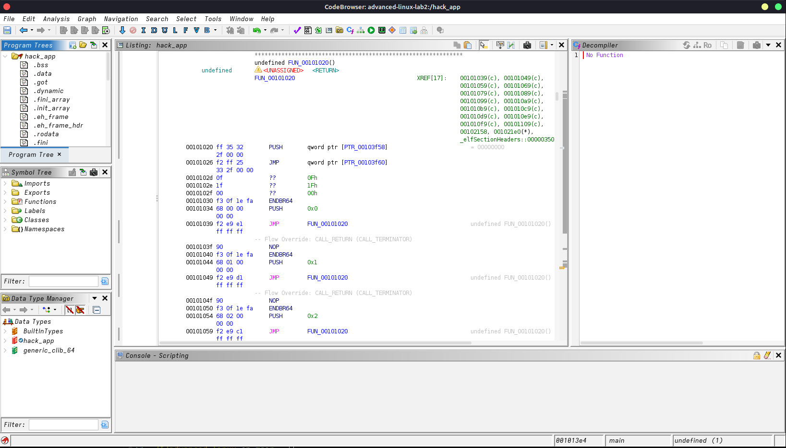
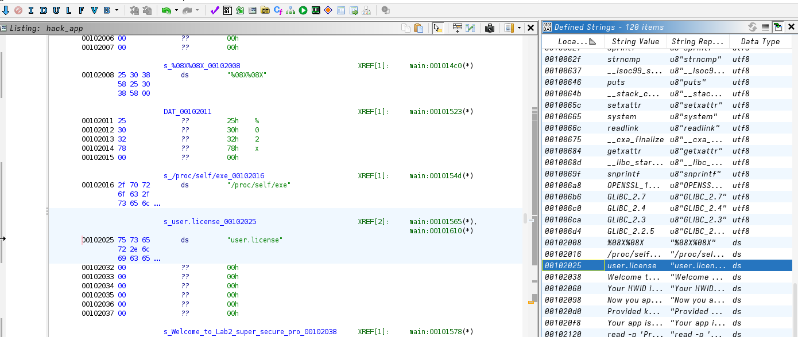

## Lab 2 [Github Repo](https://github.com/anasalatasiuni/advanced-linux-labs/tree/main/Lab2)

1. Discover and implement its license-generation algorithm (keygen).
2. Create a binary patch to disable licensing.

---

### 1. Dependency Analysis with `ldd`

```bash
$ ldd ./hack_app
    linux-vdso.so.1 (0x00007ffd42dfe000)
    libcrypto.so.1.1 => /lib/x86_64-linux-gnu/libcrypto.so.1.1
    libc.so.6 => /lib/x86_64-linux-gnu/libc.so.6
    libdl.so.2 => /lib/x86_64-linux-gnu/libdl.so.2
    libpthread.so.0 => /lib/x86_64-linux-gnu/libpthread.so.0
    /lib64/ld-linux-x86-64.so.2 (0x00007f738bede000)
```

* **Notes**: The app links against **OpenSSL** (`libcrypto`) and standard C libraries. No unusual or custom libraries detected.

---
### 2. Runtime Tracing with `strace`

To locate the license storage, we ran:

```bash
$ strace -f -e trace=file ./hack_app 2>&1 | tee strace_full.log
```

Then in the `strace.log` file I searched for license-related strings:

The only tracing attribute I found:

```bash
getxattr("./hack_app", "user.license", ..., 4096) = -1 ENODATA (No data available)
```

* The app stores its license in the **`user.license`** extended attribute on its own binary.

---
### 3. Static Analysis in GHIDRA

1. **Import** `hack_app` into GHIDRA and let auto-analysis finish.

2. **Find** the literal string **`"user.license"`** in **Window → Defined Strings**.

3. **Show references** to that string and open the first code reference in `main`.

4. **Switch** to **Decompiler** view.

5. **Annotate** the flow:

   * `getxattr(path, "user.license", buf, size)`
   * `if (ret < 0) { prompt user for key }`
   * Call to `__get_cpuid`, byte-swaps, `snprintf(psn, ...)`, `calc_md5`, loop building `md5decode`
   * `strncmp(md5decode, xattrValue, 0x21)` → branch
   * On success: `setxattr(path, "user.license", md5decode, 0x21, 0)`

---
### 4. Extracting & Implementing the License Algorithm

Based on the decompiled pseudocode:

A. **HWID Computation**

```c
__get_cpuid(1, &eax, NULL, NULL, &edx);
uint32_t hw1 = __builtin_bswap32(eax);
uint32_t hw2 = __builtin_bswap32(edx);
```

B. **PSN Formatting**

```c
char psn[17];
 snprintf(psn, sizeof(psn), "%08X%08X", hw1, hw2);
```

C. **MD5 Calculation**

```c
unsigned char digest[16];
MD5((unsigned char*)psn, 16, digest);
```

D. **License String Construction**

```c
char license[33] = {0};
for (int i = 0; i < 16; i++) {
    sprintf(license + i*2, "%02x", digest[15 - i]);
}
```

#### 4.1 Writing the Keygen (`keygen.c`)

```c
#include <stdio.h>
#include <stdint.h>
#include <cpuid.h>
#include <openssl/md5.h>

int main(void) {
    unsigned int eax, ebx, ecx, edx;
    if (!__get_cpuid(1, &eax, &ebx, &ecx, &edx)) {
        fprintf(stderr, "CPUID not supported.\n");
        return 1;
    }
    uint32_t hw1 = __builtin_bswap32(eax);
    uint32_t hw2 = __builtin_bswap32(edx);
    char psn[17];
    snprintf(psn, sizeof(psn), "%08X%08X", hw1, hw2);
    unsigned char digest[16];
    MD5((unsigned char*)psn, 16, digest);
    char license[33] = {0};
    for (int i = 0; i < 16; i++) {
        sprintf(license + i*2, "%02x", digest[15 - i]);
    }
    printf("%s", license);
    return 0;
}
```


#### 4.2 Compile & Test

```bash
$ gcc -o keygen keygen.c -lcrypto
$ ./keygen > my.lic
$ setfattr -n user.license -v (cat my.lic) ./hack_app
$ ./hack_app
```


---
### 5. Patching
The app does `strncmp(..., 0x21)` (length 33) by loading `0x21` into EDX (`BA 21 00 00 00`). Changing that to `BA 00 00 00 00` makes `strncmp(..., 0)`, which always returns equal, skipping the “wrong key” branch.

To see the code please check the [Github Repo](https://github.com/anasalatasiuni/advanced-linux-labs/tree/main/Lab2)


