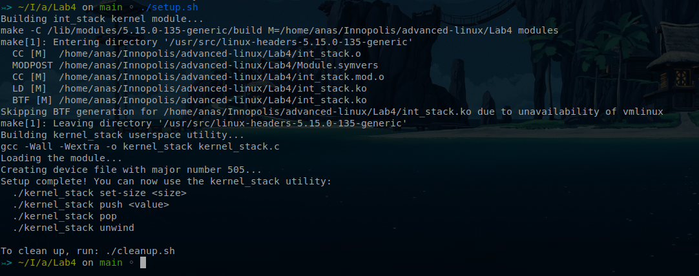
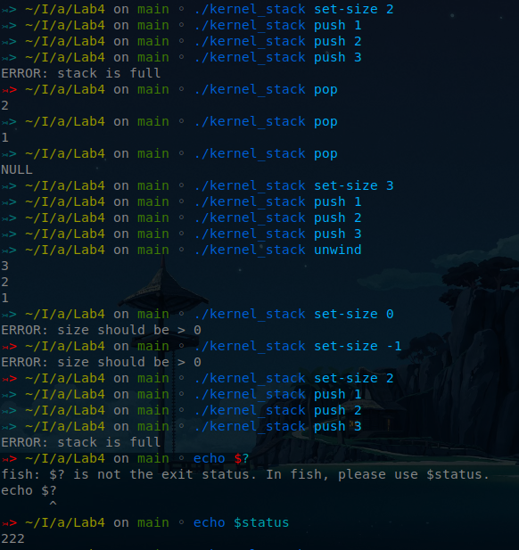

# Lab4 Integer Stack Kernel Module
[](https://github.com/anasalatasiuni/advanced-linux-labs/tree/main/Lab4)

A Linux kernel module that implements a stack for integers with push/pop operations and stack size configuration via ioctl, along with a userspace utility for interacting with it.

## Key Features

1. **Dynamic Memory Management**: 
   - Uses `kmalloc` for stack data allocation
   - Dynamically resizes the stack when needed
   - Properly frees memory with `kfree` to prevent memory leaks

2. **Synchronization for Concurrent Access**:
   - Implements reader-writer semaphores for thread-safe access
   - Uses appropriate write locks for stack-modifying operations
   - Module is safe for multi-threaded access

3. **Comprehensive Error Handling**:
   - Returns appropriate error codes (`-ERANGE`, `-EINVAL`, `-EFAULT`, etc.)
   - Checks for null pointers and invalid parameters
   - Handles memory allocation failures
   - Provides detailed kernel logs for debugging

4. **Edge Case Handling**:
   - Empty stack checks
   - Full stack checks
   - Invalid ioctl commands
   - Zero-sized stack prevention

## Building the Kernel Module

To build the kernel module:

```bash
# Build the kernel module
make

# Load the module
sudo insmod int_stack.ko

# Check the assigned major number (look for "int_stack: registered with major number X")
dmesg | grep int_stack

# Create the device file
sudo mknod /dev/int_stack c $MAJOR 0
sudo chmod 666 /dev/int_stack
```

For convenience, you can use the provided setup script:

```bash
./setup.sh
```


## Building the Userspace Utility

To build the userspace utility:

```bash
make -f Makefile.user
```
> Note: This is included in `setup.sh`

## Using the Userspace Utility

The `kernel_stack` utility provides an interface to the kernel module.

### Available Commands

1. **Push an integer onto the stack**:
   ```bash
   ./kernel_stack push VALUE
   ```

2. **Pop an integer from the stack**:
   ```bash
   ./kernel_stack pop
   ```

3. **Unwind the stack (pop and print all values)**:
   ```bash
   ./kernel_stack unwind
   ```

4. **Set the maximum stack size**:
   ```bash
   ./kernel_stack set-size SIZE
   ```

### Examples

> Note:
> * The status is `222` not `-34` is related to how shell return codes.
> * Exit codes are 8 bits (0-255) so `-34` in two's complement become `222` when interpreted as unsigned
> * I couldn't solve the issue and tried in different ways, I hope if you can suggest how to resolve this in the comments.
## Implementation Details

### Kernel Module

- The kernel module (`int_stack.ko`) implements a dynamically resizable stack of integers.
- It exposes a character device that can be accessed through standard file operations.
- Memory for the stack is allocated dynamically and grows/shrinks as needed.
- The module utilizes reader-writer semaphores for synchronization, allowing multiple readers but exclusive writers.
- Proper error codes are returned for all edge cases and error conditions.

### Userspace Utility

- The utility (`kernel_stack`) provides a user-friendly interface to interact with the module.
- It handles all communication with the device file and formats output appropriately.
- It translates error codes to user-friendly messages.

## Module File Operations

- **open()**: Initializes the stack if not already done
- **release()**: Updates module reference count
- **read()**: Pops an integer from the stack
- **write()**: Pushes an integer onto the stack
- **ioctl()**: Configures the maximum stack size

## Error Codes

The module follows standard kernel error codes:
- `-ERANGE`: Stack is full (on push)
- `-EINVAL`: Invalid parameter or operation
- `-EFAULT`: Failed to copy data between kernel and user space
- `-ENOMEM`: Memory allocation failed
- `-ENOTTY`: Invalid ioctl command

## Cleanup

```bash
# Remove the device file
sudo rm /dev/int_stack

# Unload the module
sudo rmmod int_stack

# Clean up build artifacts
make clean
make -f Makefile.user clean
```

Or simply run:

```bash
./cleanup.sh
``` 