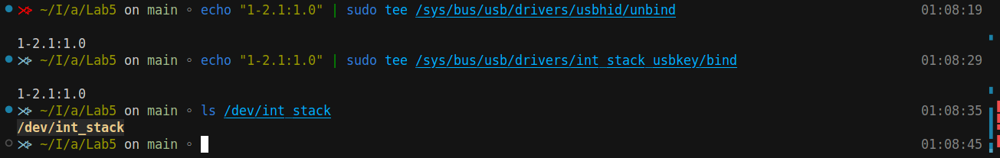
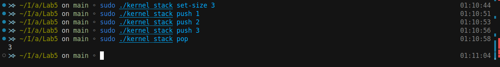
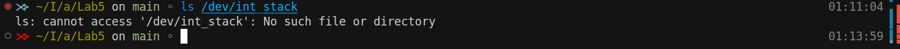
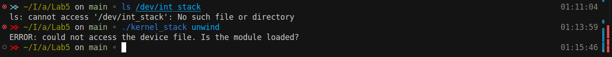
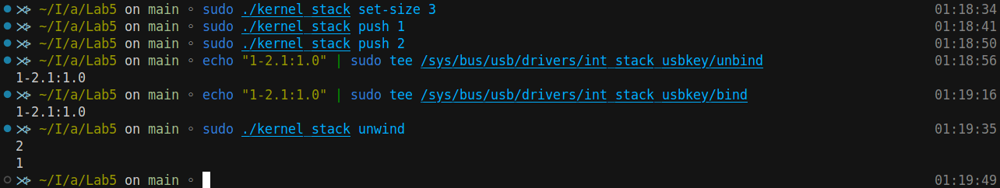
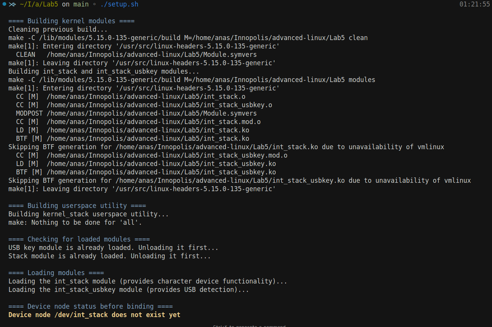
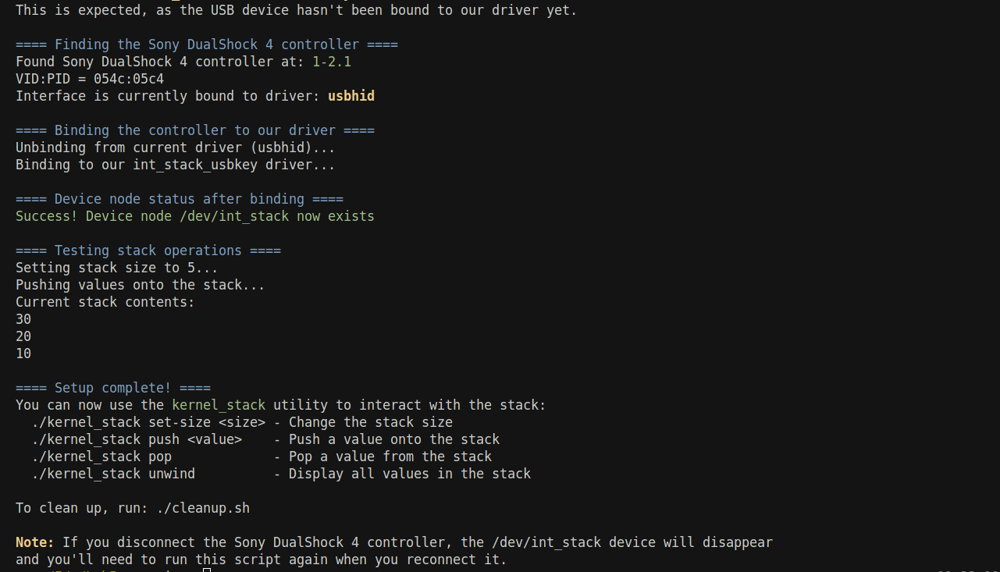
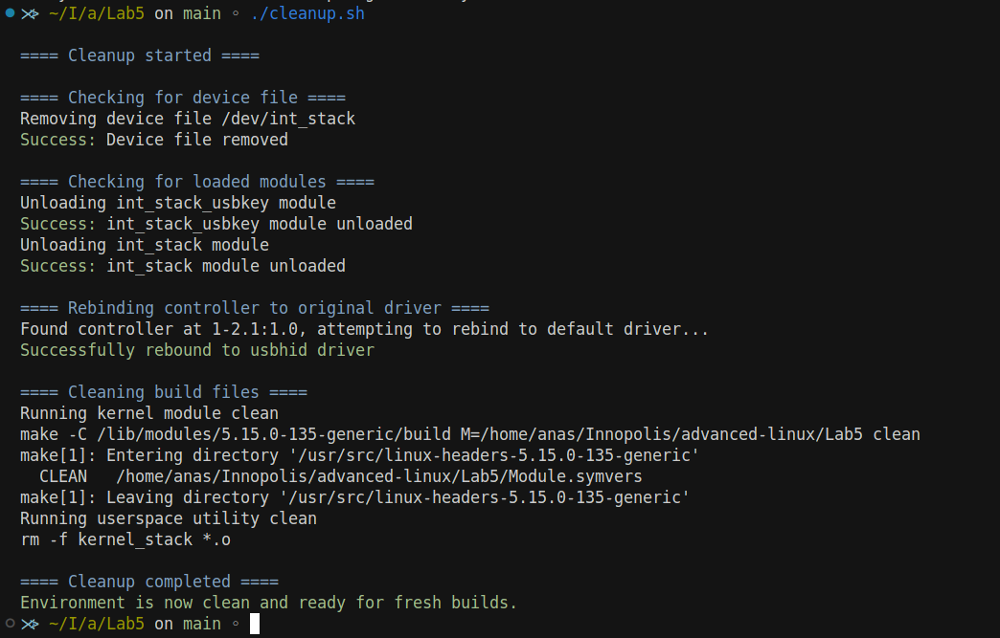

# Lab 5: USB-Secured Integer Stack Kernel Module
[](https://github.com/anasalatasiuni/advanced-linux-labs/tree/main/Lab5)


## Overview

This lab extends Lab 4 by adding USB device detection functionality. The character device (`/dev/int_stack`) is only available when a specific USB device (in this case, a Sony DualShock 4 controller) is connected to the system. When the USB device is disconnected, the device node disappears, but the stack's data is preserved.

## Key Features

1. **USB Device Detection**:
   - Uses the USB subsystem to detect a specific USB device (electronic key)
   - Character device only appears when the electronic key is connected
   - Character device disappears when the electronic key is disconnected
   - Stack data is preserved across connect/disconnect events

2. **Dynamic Character Device Creation**:
   - Device node created automatically when USB key is detected
   - Device node removed when USB key is disconnected
   - Uses proper device/class management through the kernel's device model

3. **USB Driver Implementation**:
   - Uses `struct usb_device_id` to identify the electronic key
   - Implements `probe()` and `disconnect()` callbacks
   - Manages character device during device connect/disconnect events

4. **Split Driver Design**:
   - `int_stack.c` - Core stack functionality with character device support
   - `int_stack_usbkey.c` - USB driver for electronic key detection

## Implementation Details

### Kernel Modules

The implementation consists of two kernel modules:

1. **int_stack.ko**:
   - Provides the core stack functionality with push/pop operations
   - Implements character device operations
   - Exports functions for device creation/removal

2. **int_stack_usbkey.ko**:
   - Implements USB driver functionality
   - Detects the electronic key (Sony DualShock 4 controller)
   - Creates/removes character device node based on USB key presence

### USB Device Driver

The USB driver component acts as an electronic key for the character device. It:

1. **Detect specific USB devices** using Vendor ID and Product ID matching
2. **Control device availability** by creating/removing the character device node
3. **Maintain data consistency** by preserving stack contents between connections

Key implementation aspects:

* **Device identification** uses the `USB_DEVICE()` macro to specify the target device
* **Driver registration** with the USB subsystem through `usb_register()`
* **Event handling** via `probe()` and `disconnect()` callbacks
* **Inter-module communication** through exported functions

When the specified USB device (Sony DualShock 4 controller with VID:PID 054c:05c4) is connected, the probe function creates the character device node. When disconnected, the disconnect function removes it, making the stack inaccessible until the device is reconnected.


## Building and Using the Module

### Building

To build both kernel modules:

```bash
make clean
make
```

To build the userspace utility:

```bash
make -f Makefile.user
```

### Loading Modules

The modules need to be loaded in the correct order:

```bash
# Load the core stack module first
sudo insmod int_stack.ko

# Load the USB driver module second
sudo insmod int_stack_usbkey.ko
```

### Binding the USB Device

The device will be automatically detected if it's already connected. If not, you'll need to bind it manually:

```bash
# After Identifing the USB device path
# Unbind from current driver (the defult driver automaticly bind it)
echo "1-2.1:1.0" | sudo tee /sys/bus/usb/drivers/usbhid/unbind

# Bind to our driver
echo "1-2.1:1.0" | sudo tee /sys/bus/usb/drivers/int_stack_usbkey/bind
```

### Verifying Device Node

Check if the device node was created:

```bash
ls -la /dev/int_stack
```


<!-- Run: `ls -la /dev/int_stack` after binding the USB device -->

### Testing Stack Operations

After the device node appears, you can perform stack operations:

```bash
# Set stack size
sudo ./kernel_stack set-size 3

# Push values
sudo ./kernel_stack push 1
sudo ./kernel_stack push 2
sudo ./kernel_stack push 3

# Pop values
sudo ./kernel_stack pop
```


<!-- Run: `sudo ./kernel_stack set-size 5; sudo ./kernel_stack push 10; sudo ./kernel_stack push 20; sudo ./kernel_stack push 30; sudo ./kernel_stack unwind` after binding the USB device -->

### Effect of USB Key Disconnection

When the USB key is disconnected (either physically or simulated), the device node disappears:

```bash
# I'll disconnect the controller physically or we can simulate disconnection by unbinding
echo "1-2.1:1.0" | sudo tee /sys/bus/usb/drivers/int_stack_usbkey/unbind

# Verify device node is gone
ls -la /dev/int_stack
```



### Error Handling in Userspace Utility

When trying to use the userspace utility without the USB key connected:

```bash
./kernel_stack unwind
# ERROR: could not access the device file. Is the module loaded?
```



### Data Persistence Across USB Key Reconnection

The stack data persists even when the USB key is disconnected and reconnected:

```bash
# Push values
sudo ./kernel_stack push 1
sudo ./kernel_stack push 2

# Disconnect USB key (unbind)
echo "1-2.1:1.0" | sudo tee /sys/bus/usb/drivers/int_stack_usbkey/unbind

# Reconnect USB key (bind)
echo "1-2.1:1.0" | sudo tee /sys/bus/usb/drivers/int_stack_usbkey/bind

# View values - they should still be there
sudo ./kernel_stack unwind
```




## Using the Setup Script

For convenience, a setup script is provided that:
1. Compiles both modules
2. Loads them in the correct order
3. Finds and binds the USB device
4. Tests stack operations

```bash
./setup.sh
```





## Using the Cleanup Script

To clean up:

```bash
./cleanup.sh
```

This script:
1. Removes the device node (if it exists)
2. Unloads both modules in the correct order
3. Rebinds the USB device to its original driver
4. Cleans build files




## Challenges I faced

**Driver Conflicts**: The Sony controller is normally claimed by the `usbhid` driver. We need to unbind it from this driver before binding to our custom driver, finding the correct driver to unbind the controller was challenging for me.
